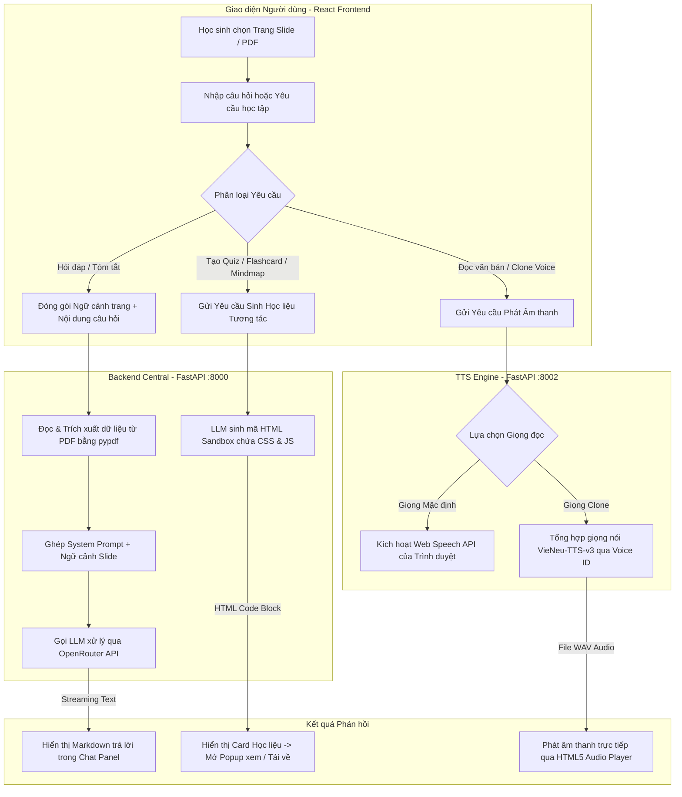

# AI Tutor (Dự án Hackathon Baby Shark - D304)

Dự án Hệ thống Trợ lý Học tập Thông minh bằng Trí tuệ Nhân tạo (AI Tutor).

## 👥 Danh sách Thành viên & Phân công nhiệm vụ

| STT | Họ và Tên | Mã Học Viên | Phân công vai trò dự kiến |
|---|---|---|---|
| 1 | Phạm Hoàng Anh | 2A202601368 | AI Engineer (Tối ưu Prompt & Tích hợp LLM) |
| 2 | Nguyễn Mai Nhật Anh | 2A202601826 | Full-stack Developer (Tích hợp AI & UI/UX) |
| 3 | Bùi Công Hậu | 2A202601877 | Backend Developer (Xử lý FastAPI & Logic) |
| 4 | Bùi Xuân Hòa | 2A202601202 | Audio / TTS Engineer (Phát triển tính năng Voice Clone/TTS) |
| 5 | Phạm Tiến Hưng | 2A202601800 | QA / Documentation (Kiểm thử, Nghiệm thu & Viết Spec) |

---

## 🎯 Tóm tắt Dự án
**AI Tutor (Baby Shark - D304)** là một hệ thống trợ lý học tập thông minh, giúp sinh viên/học sinh tự học và ôn tập hiệu quả thông qua tài liệu (Slide/PDF). Thay vì phải đọc những trang tài liệu dài dòng, học sinh có thể trực tiếp đặt câu hỏi, yêu cầu AI giải thích và tương tác sinh động thông qua các bài tập kiểm tra, flashcard và sơ đồ tư duy.

## 🚀 Chức năng Chính (Key Features)
1. **Đọc hiểu Tài liệu theo Ngữ cảnh:** Tự động định vị nội dung tài liệu người dùng đang xem để trả lời câu hỏi chính xác mà không bịa đặt thông tin.
2. **Sinh Học liệu Tương tác (HTML Sandbox):** Khả năng tự động tạo mã HTML chứa CSS & JavaScript để sinh ra Bài kiểm tra (Quiz) chấm điểm tự động, thẻ Flashcard lật 2 mặt, và Sơ đồ tư duy (Mindmap bằng Mermaid.js) hiển thị trực quan ngay trên trình duyệt.
3. **Giải thích chuyên sâu đa ngữ:** Trả lời bằng đúng ngôn ngữ học sinh hỏi. Khi giải bài tập, tự động giải thích chi tiết lý do đúng/sai và tóm tắt lại lý thuyết liên quan.
4. **Trợ lý Giọng nói (TTS & Voice Clone):** Hỗ trợ đọc câu trả lời bằng giọng hệ thống chuẩn xác, hoặc thu âm để AI bắt chước chính xác giọng của học sinh.

## 💻 Công nghệ Sử dụng (Tech Stack)
*   **Frontend:** React, Vite, Tailwind CSS, React Markdown.
*   **Backend & API:** Python, FastAPI, Thư viện đọc PDF (`pypdf`).
*   **AI Models:**
    *   **LLM:** Tích hợp mô hình Ngôn ngữ Lớn qua cổng OpenRouter (Hỗ trợ GPT, Claude, Gemini...).
    *   **Âm thanh:** Web Speech API, Hệ thống Voice Clone & TTS nội địa (VieNeu-TTS-v3) qua API độc lập.

## 🔄 Quy trình Hoạt động (Workflow)

